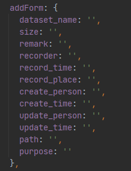
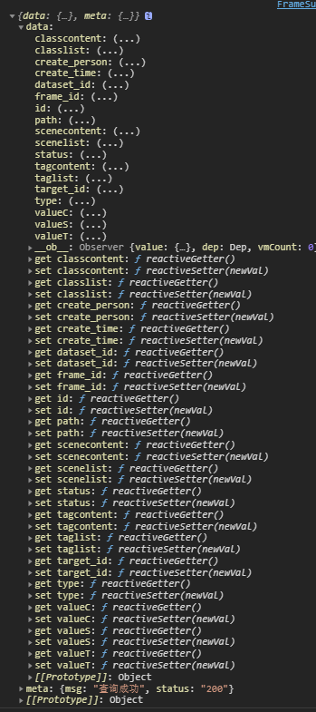
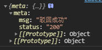

# 接口文档

## 数据集管理

### 数据集列表

#### 1.获得所有数据集

地址：/datasets/queryDatasetsVague

传入参数

String query, int pageNumber, int pageSize, String VSString, String VCString

返回参数

datasets下的数据集列表

meta下的状态码

#### 2.根据id查找数据集

用于修改以及操作时再修改视图中填入当前修改对象的信息

地址：/datasets/getDatasetById

传入参数: int id

返回参数：数据集对象，包含数据集的信息

#### 3.提交修改数据集审核申请

地址：audit/editDatasetAudit

传入参数：editform，包含 

传回参数：

#### 4.提交添加数据集申请

地址：audit/addDatasetAudit

传入参数：

传回参数：

### 数据集详情（帧）

#### 1.获得所有帧

地址：search/queryFrame

传入参数：

传回参数：

#### 2.添加帧审核申请

地址：audit/addFrameAudit

传入参数：

传回参数：

#### 3.根据id获取相应的帧信息

地址：frame/getFrameById

传入参数：int id

传回参数：                                                                                     

#### 4.修改帧审核申请

地址：frame/editFrameInfo

传入参数：

传回参数：

#### 5.删除帧申请提交

地址：frame/RemoveFrameInfo

传入参数：

传回参数：

### 帧详情（标签）

#### 1.获取所有的帧标签

地址：search/queryLabel

传入参数：

传回参数：

#### 2.根据Id获取标签的信息

地址：label/getLabelById

传入参数：int id

传回参数：

#### 3.添加标签审核申请

地址：audit/addLabelAudit

传入参数：

传回参数：

#### 4.修改标签审核申请

地址：label/editLabel

传入参数：

传回参数：

#### 5.删除标签审核申请

地址：label/RemoveLabel

传入参数：

传回参数：

## 分类管理

#### 1.场景

##### 1.获取所有的场景

地址：categorise/querySceneVague

传入参数：

传回参数：

##### 2.添加场景

地址：categorise/addScene

传入参数：

传回参数：

##### 3.编辑场景

地址：categorise/editScene

传入参数：

传回参数：

##### 4.根据id获得场景的详细信息

地址：categorise/getSceneById

传入参数：int id

传回参数：

##### 5.删除场景

地址：categorise/removeScene

传入参数：int id

传回参数：

#### 2.分类

##### 1.获取所有的分类

地址：categorise/queryClasscificationVague

传入参数：

传回参数：

##### 2.添加分类

地址：categorise/addClass

传入参数：

传回参数：

##### 3.编辑分类

地址：categorise/editClass

传入参数：

传回参数：

##### 4.根据id获得分类的详细信息

地址：categorise/getClassById

传入参数：int id

传回参数：

##### 5.删除分类

地址：categorise/removeClass

传入参数：int id

传回参数：

#### 3.标签

##### 1.获取所有的标签

地址：categorise/queryTagVague

传入参数：

传回参数：

##### 2.添加标签

地址：categorise/addTag

传入参数：

传回参数：

##### 3.编辑标签

地址：categorise/editTag

传入参数：

传回参数：

##### 4.根据id获得标签的详细信息

地址：categorise/getTagById

传入参数：int id

传回参数：

##### 5.删除标签

地址：categorise/removeTag

传入参数：int id

传回参数：

## 数据查找

### 1.获取所有帧或标签（可切换）

地址：search/queryFrame

传入参数：

传回的参数：

当extendLabel为1时，查询的是所有的帧

当extendLabel为2时，查询的是所有的帧的标签

## 角色管理

### 1.查询角色

地址：user/queryUserVague

传入参数：

传回参数：

### 2.修改角色

地址：user/editUser

传入参数：

传回参数：

### 3.根据id查询角色

地址：user/getUserById

传入参数：int id

传回参数：

### 3.删除角色

地址：user/removeUser

传入参数：int id

传回参数：

### 4.增加角色

地址：user/addUser

传入参数：

传回参数：

## 审核管理

### 一.数据集审核

#### 1.获取所有数据集审核信息

地址：audit/queryAuditVague

传入参数：

传回参数：

#### 2.根据id获取数据集审核信息

地址：audit/getAuditById

传入参数：int id

传回参数：

#### 3.修改数据集审核信息

地址：audit/editAudit

传入参数：

传回参数：

#### 4.通过数据集审核信息

地址：audit/approve

传入参数：

传回参数：

#### 5.驳回数据集审核申请

地址：audit/deny

传入参数：

传回参数：

### 二.帧审核

#### 1.获取所有帧审核信息

地址：audit/queryFrameAuditVague

传入参数：

传回参数：

#### 2.根据id获取帧审核信息

地址：audit/getFrameAuditById

传入参数：int id

传回参数：

#### 3.修改帧审核信息

地址：audit/editFrameAudit

传入参数：

传回参数：

#### 4.通过帧审核信息

地址：audit/approveFrame

传入参数：

传回参数：                                                     

#### 5.驳回帧审核申请

地址：frame/denyframe

传入参数：                                                                          

tokenStr1为当前操作人的姓名

传回参数：

### 三.标签审核

#### 1.获取所有标签审核信息

地址：label/queryLabelAuditVague

传入参数：

传回参数：

#### 2.根据id获取标签审核信息

地址：label/getLabelAuditById

传入参数：int id

传回参数：

#### 3.修改标签审核信息

地址：label/editLabelAudit

传入参数：

传回参数：

#### 4.通过标签审核信息

地址：label/approveLabel

传入参数：

传回参数：

#### 5.驳回标签审核申请

地址：label/denyLabel

传入参数：                                                            

name为当前操作人的姓名

传回参数：

